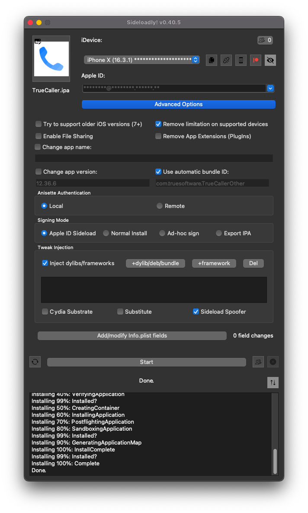

# frida-ios-dump
A tool to extract a decrypted IPA from a jailbroken, **rootless** device.

## Usage

To use frida-ios-dump, follow these steps:
1. Install [frida](http://www.frida.re/) on your device.
   You have two options:
   - Add [my repo](https://miticollo.github.io/repos/#my).
   - Compile it yourself.
     For more information, refer to the dedicated [gist](https://gist.github.com/miticollo/6e65b59d83b17bacc00523a0f9d41c11).
2. <span id="clone"></span>
   Clone this project by typing the following command in your terminal window:
   ```shell
   git clone --depth=1 -j8 https://github.com/miticollo/frida-ios-dump.git
   cd frida-ios-dump/
   ```
3. Run `sudo pip install -r requirements.txt --upgrade` to install the necessary dependencies.
   > **Note**<br/>
   > Upgrade dependencies such as `frida-tools` and `frida` using the command `sudo pip install -r requirements.txt --upgrade`.
4. Enable SSH forwarding over USB using `iproxy`.
   For example, run `iproxy -ddd 2222:22`.
5. On the device, install `curl`, `ldid` and `openssh` from Procursus. 
   Then, run the following commands as **root** either over SSH or in a terminal window:
   ```shell
   curl -LO --output-dir /var/tmp/ 'https://raw.githubusercontent.com/miticollo/frida-ios-dump/master/scp.entitlements'
   ldid -S/var/tmp/scp.entitlements -M "$(which scp)"
   rm -v /var/tmp/scp.entitlements
   ```
   <span><!-- https://discord.com/channels/349243932447604736/1082886572011180053/1092577566008807494 --></span>
6. To use frida-ios-dump properly, you must have scp on your PATH. 
   - For Debian based OS:
     ```shell
     sudo apt install -y openssh-client
     ```
   - For Arch based OS:
     ```shell
     pacman -S openssh
     ```
   - For Windows, see [below](#windows).
7. **Open the target app on the device.**
8. Connect iDevice to macOS/PC using USB lightning cable.
9. Run `./dump.py <target>`

```
./dump.py Spotify 
Start the target app Spotify
Dumping Spotify to /var/folders/q2/x23bcyr53w3dnmlh2fqjp2mr0000gp/T
start dump /private/var/containers/Bundle/Application/56AE666E-0F06-4969-91C8-5B63F33ECF58/Spotify.app/Spotify
Spotify.fid: 100%|██████████| 112M/112M [00:03<00:00, 35.5MB/s]
start dump /private/var/containers/Bundle/Application/56AE666E-0F06-4969-91C8-5B63F33ECF58/Spotify.app/Frameworks/SpotifyShared.framework/SpotifyShared
SpotifyShared.fid: 100%|██████████| 4.26M/4.26M [00:00<00:00, 19.8MB/s]
AppIntentVocabulary.plist: 125MB [00:10, 13.1MB/s]
Generating "Spotify.ipa"
0.00B [00:00, ?B/s]
```

Congratulations!!! You've got a decrypted IPA file.

### How to install it?

To install the app, sideload it as follows:
- Use [Sideloadly](https://sideloadly.io/)
  
  > **Note**<br/>
  > Enable “Sideload Spoofer” as some apps may not work after decryption.

## Windows

1. Go to http://www.msys2.org/ and download the x86_64 installer
2. Follow the instructions on the page for setting up the basic environment
3. Run `C:\msys64\mingw64.exe` - a terminal window should pop up
4. Execute `pacman -Suy`
5. Execute `pacman -S git openssh python-pip`
6. Go to step [2](#clone)

## Tested environment

- iPhone XR with iOS 15.1b1 jailbroken using [Dopamine](https://github.com/opa334/Fugu15/releases/tag/1.0.0-beta.8)
- [Python3](https://github.com/pyenv/pyenv)